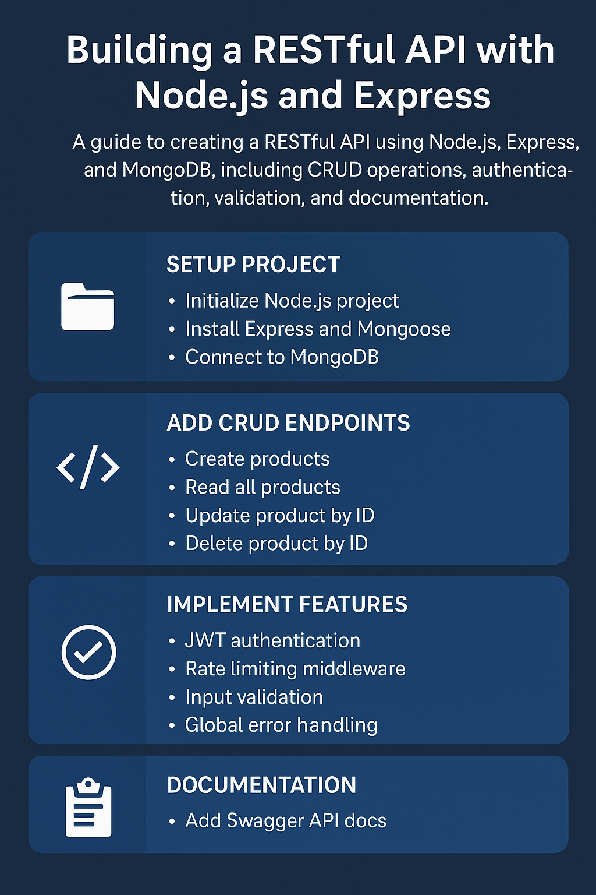

--- 
title: "Building a RESTful API with Node.js and Express - Explained"

excerpt: "A step-by-step tutorial for creating your own REST API with Node.js, Express, and MongoDB. Build, secure, and document your API!"

categories:
- Node.js
- Backend-Development

tags:
- REST API
- Node.js
- Express
- MongoDB
- API Development
- Backend

--- 

## Introduction to RESTful APIs

In the world of web development, APIs are the backbone of data communication between different systems. In this post, we’ll explore how to build a **RESTful API** from scratch using **Node.js** and **Express**.

If you’re new to REST, it stands for *Representational State Transfer*, an architectural style that relies on standard HTTP methods such as **GET**, **POST**, **PUT**, and **DELETE** to perform CRUD (Create, Read, Update, Delete) operations.

A REST API is:

- **Stateless**: Individual requests are treated separately.
- **Cacheable**: Responses can be cached for performance.
- **Resource-based**: Handles structured resources (e.g., users, products, etc.).

Why use **Node.js** and **Express** for this?

- Node.js's event-driven, non-blocking style is perfect for building APIs that can handle lots of concurrent connections.
- Express simplifies routing, middleware use, and server creation, and is the most popular Node.js web framework.

---

## Prerequisites

Before we start, make sure you have:

- **Node.js** and **npm** installed (if necessary, follow our previous guide).
- Basic understanding of **JavaScript** and **HTTP verbs**.
- An API testing tool like **Postman** or **Thunder Client** (VS Code extension).

-----

## Step 1: Setting Up the Project

Create a project directory first:

```bash
mkdir express-api && cd express-api
```

Initialize a new Node.js project:

```bash
npm init -y
```

Install **Express**:

```bash
npm install express
```

-----

## Step 2: Creating a Basic Server

Create a file named `app.js`:

```javascript
const express = require('express');
const app = express();
const PORT = 3000;

// Middleware to parse JSON bodies
app.use(express.json());

// Root endpoint
app.get('/', (req, res) => {
  res.send('Welcome to the API!');
});

// Start server
app.listen(PORT, () => {
  console.log(`Server running on http://localhost:${PORT}`);
});
```

Start the server:

```bash
node app.js
```

Visit [http://localhost:3000](http://localhost:3000) — you should see "Welcome to the API!".

---

## Step 3: Connecting to MongoDB

Let's create a database.

Install **Mongoose**:

```bash
npm install mongoose
```

Update `app.js` to connect to MongoDB:

```javascript
const mongoose = require('mongoose');

mongoose.connect('mongodb://localhost:27017/mydb', {
  useNewUrlParser: true,
  useUnifiedTopology: true
})
.then(() => console.log('Connected to MongoDB'))
.catch(err => console.error('MongoDB connection error:', err));
```

---

## Step 4: Defining a Model

Let's define a **Product** model.

Create a new file `models/Product.js`:

```javascript
const mongoose = require('mongoose');

const productSchema = new mongoose.Schema({
  name: { type: String, required: true },
  price: { type: Number, required: true },
  description: String
});

module.exports = mongoose.model('Product', productSchema);
```

---

## Step 5: Creating CRUD Routes

Back in `app.js`, let's add the Create, Read, Update, and Delete operations' routes.

```javascript
const Product = require('./models/Product');

// Create a product
app.post('/products', async (req, res) => {
  try {
    const product = new Product(req.body);
    await product.save();
    res.status(201).send(product);
  } catch (err) {
    res.status(400).send(err.message);
  }
});

// Read all products
app.get('/products', async (req, res>)
try {
  const products = await Product.find();
  res.send(products);
} catch (err) {
  res.status(500).send(err.message);
});

// Update a product
app.put('/products/:id', async (req, res) => {
  try {
    const product = await Product.findByIdAndUpdate(req.params.id, req.body, { new: true });
    res.send(product);
  } catch (err) {
    res.status(404).send('Product not found');
  }
});

// Delete a product
app.delete('/products/:id', async (req, res) => {
  try {
    await Product.findByIdAndDelete(req.params.id);
    res.send('Product deleted');
  } catch (err) {
    res.status(404).send('Product not found');
  }
});

---

## Step 6: Global Error Handling

Add a global error handler **after** your routes:

```javascript
app.use((err, req, res, next) => {
  console.error(err.stack);
  res.status(500).send('Something went wrong!');
});
```

---

## Step 7: Testing the API

Open **Postman** or **Thunder Client**.

Make a POST request to `http://localhost:3000/products` with the body like:

```json
{
  "name": "Laptop",
  "price": 999.99,
  "description": "High-performance laptop"
}
```

Test all CRUD endpoints (POST, GET, PUT, DELETE) to ensure that everything works as expected.

---

## Step 8: Adding Authentication with JWT

Time to add security to our API!

Install required packages:

```bash
npm install jsonwebtoken bcryptjs
```

Create an authentication middleware:

```javascript
const jwt = require('jsonwebtoken');

const authenticate = (req, res, next) => {
  const token = req.header('Authorization')?.replace('Bearer ', '');
```
if (!token) return res.status(401).send('Access Denied');

  try {
    const verified = jwt.verify(token, 'your-secret-key');
    req.user = verified;
    next();
  } catch (err) {
    res.status(400).send('Invalid Token');
  };
};

Use it to protect private routes:

```javascript
app.get('/profile', authenticate, (req, res) => {
  res.send('Welcome to your profile');
});
```

---

## Step 9: Rate Limiting and Input Validation

### Rate Limiting

Limit API abuse by limiting requests.

Install **express-rate-limit**:

```bash
npm install express-rate-limit
```

Configure basic rate limiting:

```javascript
const rateLimit = require('express-rate-limit');

const limiter = rateLimit({
  windowMs: 15 * 60 * 1000, // 15 mins
  max: 100 // limit each IP to 100 requests per windowMs
});

app.use(limiter);
```

### Input Validation

Install **express-validator**:

```bash
npm install express-validator
```

Validate user input:

```javascript
const { body, validationResult } = require('express-validator');

app.post('/products',
  body('name').notEmpty(),
  body('price').isFloat({ min: 0 }),
  (req, res) => {
    const errors = validationResult(req);
```
if (!errors.isEmpty()) return res.status(400).json({ errors: errors.array() });

    // Save product logic
});
```

---

## Step 10: API Documentation using Swagger

Self-documenting API, please!

Install Swagger tools:

```bash
npm install swagger-ui-express swagger-jsdoc
```

Configure Swagger in `app.js`:

```javascript
const swaggerJsdoc = require('swagger-jsdoc');
const swaggerUi = require('swagger-ui-express');

const options = {
  definition: {
    openapi: '3.0.0',
    info: { title: 'Products API', version: '1.0.0' },
  },
  apis: ['./app.js'],
};
```

const specs = swaggerJsdoc(options);

app.use('/api-docs', swaggerUi.serve, swaggerUi.setup(specs));
```

Add JSDoc comments above your routes so Swagger can auto-gen docs!

Check out [http://localhost:3000/api-docs](http://localhost:3000/api-docs) to see your interactive API documentation!

---

## Closing Notes

And that's it! ????

In this guide, we built a **RESTful API** with **Node.js**, **Express**, and **MongoDB**, including:

- CRUD operations
- JWT authentication
- Rate limiting
- Input validation
- Auto-generated API documentation

In this second part, we'll take this project further by **dockerizing it with Docker**, adding **pagination**, **advanced filtering**, and **deployment recommendations**.

Stay tuned!
 

---

Would you also like me to include a **summary infographic** at the end of the post to make it that extra bit special? ????
(takes only a minute to whip up if you'd like!)
---------------------------------------------

If you've ever wondered how to modify a PowerShell array after you've created it, you're not alone! This is an oft-asked question — and today I'm breaking it down into super simple steps.

## What Is an Array in PowerShell?

Straight from the PowerShell documentation:

> An array is a special structure designed to store groups of items — they can be all alike or completely different.
> Starting with PowerShell 3.0, even a single object behaves like an array sometimes!

Building one? It's easier than you think. Here's an example you've probably already been using:

```powershell
$adUsers = Get-AdUser -Filter '*' -Server $adDomainController
```

This command loads a whole list of Active Directory users into an array.

Need to create an empty array? Here's how:

```powershell
$myArray = @()

# Or, declare the type explicitly
[array]$myArray = @()
```

You can also load it up with values:

```powershell
$myArray = (1,2,3,4,5)
```

Boom! You've got an array with five numbers in it.

## Adding Items to an Existing PowerShell Array

Now suppose you want to slip a 6 into that array. If you do this:

```powershell
$myArray.Add(6)
```

You'll get an error saying the array size is fixed — it can't be expanded!

Instead, use the trusty **+=** operator:

```powershell
$myArray += 6

# Verify it worked
$myArray.length

6
```

**Behind the scenes:**
PowerShell builds a brand new array with your new addition and swaps it in place of the old one — all in the background.

## Need More Flexibility? Say Hello to ArrayList

Need to add or remove things dynamically without the "fixed size" anxiety, you'll love **ArrayList**:

```powershell
# Create an ArrayList
$myArrayList = New-Object System.Collections.ArrayList($null)

# Add items easily
[void]($myArrayList.Add(1))
[void]($myArrayList.Add(2))

# Check the count
2
```

Need to remove something?

```powershell
# Remove item by index
$myArrayList.RemoveAt(1)
```

**Pro Tip:**
Use `[void]` when appending elements to keep your console clean from unwanted outputs.

### Faster Method to Initialize ArrayList

Avoid using the slower-by-a-tenth *New-Object* method! Do this instead:

```powershell
[System.Collections.ArrayList]$myArray = @()
```

This tiny trick is a resource saver and gets your scripts to run faster — a huge plus on bigger projects!

Or simply cast a regular array:

```powershell
$myArray = [System.Collections.ArrayList]@()
```

## Conclusion

Here's one rule of thumb:
While PowerShell does not *require* you to define types, I recommend it for more clarity — especially if your scripts are several hundred lines long!

Compare:

```powershell
[string]$myString = 'Some Text'
```
to

```powershell
$myString = 'Some Text'
```

**Bottom line:**
Defining types saves your future self (and anyone else) a lot of time to understand your scripts!



---
